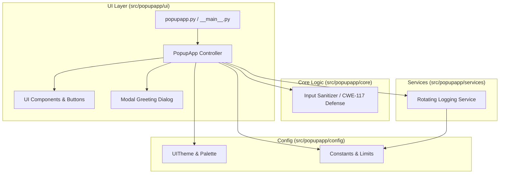

<div align="center">

# 🏰 PopUp App

**A lightweight, production-grade cross-platform desktop popup & greeting application built with modern Python and Tkinter.**

[English](README.md) • [Türkçe](README_TR.md) • [Architecture](docs/ARCHITECTURE.md) • [Build Guide](docs/BUILD.md) • [Security](docs/SECURITY.md)

</div>

---

## 🌟 Key Highlights

- ⚡ **Ultra-Fast Startup**: Zero heavy dependencies, pure standard library execution with Tkinter.
- 🛡️ **Hardened Security**: Built-in protection against CRLF Log Injection (CWE-117) and automatic log rotation (DoS defense).
- 🎨 **Modern Dark Aesthetics**: Premium dark theme with vibrant gold accents and jitter-free hover interactions.
- 🪟 **True Modal Management**: Centered windows on screen/parent with strict modal focus and single-instance popup controls.
- 📁 **Cross-Platform OS Logging**: Automatic OS-standard log directory routing (Linux XDG, macOS Application Support, Windows AppData).
- 🚀 **CI/CD & Single-File Binaries**: Multi-OS GitHub Actions workflow and PyInstaller packaging.

---

## 🏛️ Architecture Overview



---

## 📂 Project Structure

```text
PopUp-App/
├── .editorconfig
├── .gitattributes
├── .gitignore
├── CODE_OF_CONDUCT.md
├── CONTRIBUTING.md
├── LICENSE
├── Makefile                       # Development & build task automation
├── README.md                      # English documentation
├── README_TR.md                   # Turkish documentation
├── SECURITY.md                    # Security policy & controls
├── CHANGELOG.md                   # Release notes & semantic versioning
├── pyproject.toml                 # Packaging & pytest configuration
├── dev-install.txt                # Development dependencies
├── install.txt                    # Runtime dependencies (pure stdlib)
├── Dockerfile                     # Reproducible build container
├── logo.png                       # Application icon asset
├── popupapp.py                    # Root execution entry point
├── popupapp.spec                  # PyInstaller build specification
├── docs/                          # In-depth technical documentation
│   ├── ARCHITECTURE.md
│   ├── BUILD.md
│   ├── INSTALL.md
│   └── SECURITY.md
├── scripts/                       # Developer automation scripts
│   ├── dev.sh
│   ├── test.sh
│   ├── lint.sh
│   ├── build.sh
│   └── clean.sh
├── src/popupapp/                  # Core package
│   ├── config/                    # Theme and constants
│   ├── core/                      # Domain logic & sanitization
│   ├── services/                  # OS-aware logging & rotation
│   └── ui/                        # Presentation & modal components
└── tests/                         # Comprehensive test suite
    ├── conftest.py
    ├── unit/                      # Unit tests
    └── integration/               # Integration tests
```

---

## 🚀 Quickstart

### 1. Run from Source

```bash
# Clone the repository
git clone https://github.com/Sopwit/PopUp-App.git
cd PopUp-App

# Run directly
make run
```

### 2. Run Tests & Validation

```bash
# Install development dependencies
make dev-install

# Run full test suite
make test

# Check syntax and test execution
make check
```

### 3. Build Standalone Binary

```bash
make build
# Binary created at: dist/popupapp
```

---

## 📜 Log Storage Locations

| Operating System | Default Path |
| :--- | :--- |
| **Linux / BSD** | `~/.local/share/super_popup_app/app_log.txt` |
| **macOS** | `~/Library/Application Support/super_popup_app/app_log.txt` |
| **Windows** | `%APPDATA%\super_popup_app\app_log.txt` |

---

## 📄 License

Distributed under the MIT License. See [`LICENSE`](LICENSE) for details.
