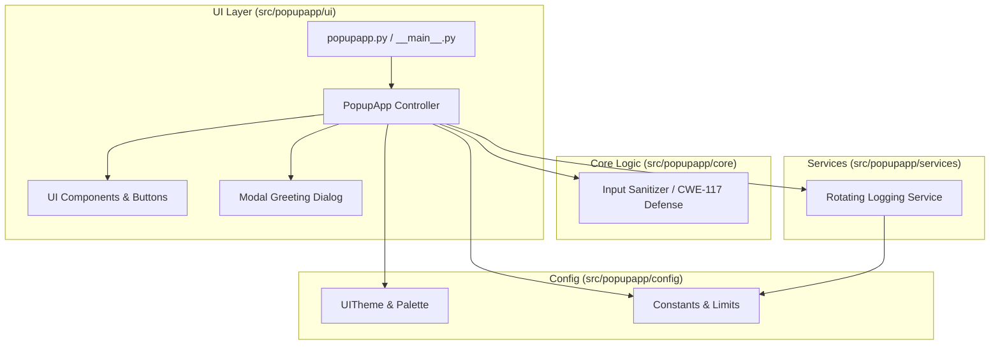

# Architecture Documentation

## Overview

`PopUp-App` is engineered following a clean layered architecture with strict separation between presentation, core domain logic, infrastructure services, and configuration.

## Layer Responsibilities

### 1. Presentation Layer (`src/popupapp/ui`)
- **`app.py`**: Manages Tkinter window lifecycle, error trapping, event dispatching, and modal state transitions.
- **`components.py`**: Encapsulates window centering math, styled button factories with jitter-free hover bindings, and layout helpers.

### 2. Core Domain Layer (`src/popupapp/core`)
- **`sanitization.py`**: Enforces strict input hygiene by stripping ANSI/ASCII control characters (`\r`, `\n`, `\t`, null bytes), collapsing excessive whitespace, and enforcing maximum string length.

### 3. Services Layer (`src/popupapp/services`)
- **`logging_service.py`**: Detects standard OS data directories (Windows `%APPDATA%`, macOS `Application Support`, Linux XDG `~/.local/share`), applies secure directory permissions (`0o700`), and configures `RotatingFileHandler` with 1MB size limit and backup rotation.

### 4. Configuration Layer (`src/popupapp/config`)
- **`constants.py`**: Centralized Single Source of Truth for system limits, dimensions, and app names.
- **`theme.py`**: Immutable dataclass containing color palettes and typography definitions.
