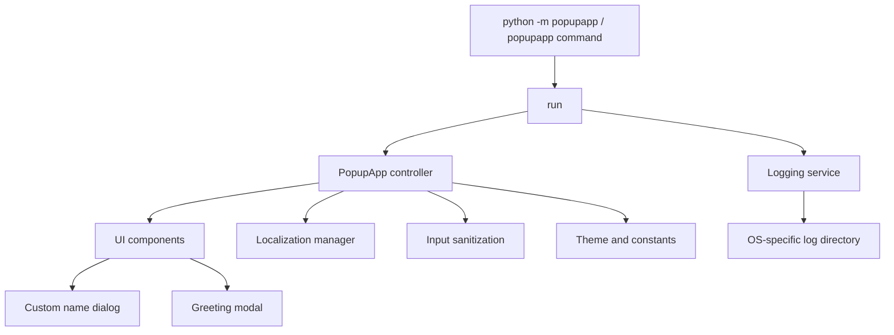

# Architecture

## System overview

PopUp App is a single-process desktop application. The UI is implemented with Tkinter and is split from input handling, localization, configuration, and logging so each layer has a narrow responsibility.

## Package layout

| Location | Responsibility |
| --- | --- |
| `src/popupapp/__main__.py` | Module entry point for `python -m popupapp`. |
| `src/popupapp/ui/app.py` | Application controller, window lifecycle, shortcuts, status updates, and modal ownership. |
| `src/popupapp/ui/components.py` | Shared Tkinter widget factories, centering, and custom input dialog. |
| `src/popupapp/core/sanitization.py` | Boundary normalization for user-provided names. |
| `src/popupapp/i18n/translations.py` | Translation catalog and locale listener management. |
| `src/popupapp/services/logging_service.py` | Log path resolution and rotating file logger configuration. |
| `src/popupapp/config/` | Application constants and immutable visual theme. |
| `src/popupapp/assets/` | Packaged icon resources. |

## Runtime flow

1. `run()` configures a named rotating logger and creates `PopupApp`.
2. `PopupApp` loads its packaged icon, builds the main view, attaches the locale listener, and binds keyboard shortcuts.
3. The greeting action opens a themed input dialog with a modal grab.
4. The entered value is sanitized before it is logged or interpolated into a greeting.
5. A greeting `Toplevel` receives modal ownership. Closing it releases the grab and restores normal application interaction.
6. Closing the main window releases modal state and unregisters the locale listener.

## Boundary rules

- The UI never writes logs directly; it receives a configured logger.
- Only `sanitize_input()` handles untrusted name input before logging.
- Theme values and size limits are centralized in `config/`.
- Asset lookup uses package resources rather than the current working directory.
- Tests create isolated Tk roots and skip GUI-only cases only when a display server is unavailable.

## Distribution architecture

PyInstaller packages the module entry point and package assets. The AppImage builder installs that binary, desktop entry, icon, and AppStream metadata into an AppDir before producing a portable artifact. See [Build](BUILD.md) and [Release](RELEASE.md).
