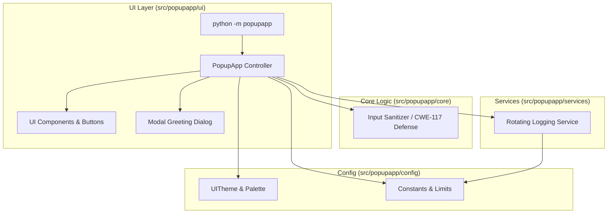

<div align="center">

# 🏰 Super Modern PopUp App

**Modern Python ve Tkinter ile geliştirilmiş, kurumsal standartlarda, hafif ve çapraz platform masaüstü karşılama ve bildirim uygulaması.**

[](https://github.com/Sopwit/PopUp-App/actions/workflows/ci.yml)
[](https://www.python.org/)
[](../../LICENSE)
[](../ARCHITECTURE.md)

[English](../../README.md) • [Türkçe](README.tr.md) • [Mimari](../ARCHITECTURE.md) • [Derleme Rehberi](../BUILD.md) • [Güvenlik](../SECURITY.md)

</div>

---

## 🌟 Öne Çıkan Özellikler

- ⚡ **Ultra Hızlı Başlangıç**: Ağır harici bağımlılık içermez, saf standart kütüphane ve Tkinter üzerinde çalışır.
- 🛡️ **Gelişmiş Güvenlik**: CRLF Log Injection (CWE-117) koruması ve otomatik dosya boyutu rotasyonu (Disk DoS önleme).
- 🎨 **Modern Koyu Arayüz**: Titreşimsiz (jitter-free) buton geçişleri, altın rengi vurgular ve şık koyu tema.
- 🪟 **Gerçek Modal Pencere Mimarisi**: Ebeveyn pencere veya ekran merkezine otomatik konumlanma (`center_window`), tekil aktif popup kontrolü ve klavye kısayolları (`<Return>`, `<Escape>`).
- 📁 **İşletim Sistemine Uyumlu Loglama**: Linux XDG, macOS Application Support ve Windows AppData dizinlerine güvenli yazım.
- 🚀 **CI/CD & Tek Dosya Binary**: GitHub Actions çoklu platform CI ve PyInstaller tek dosya binary üretimi.

---

## 🏛️ Mimari Tasarım



---

## 📂 Proje Yapısı

```text
PopUp-App/
├── .editorconfig
├── .gitattributes
├── .gitignore
├── LICENSE
├── Makefile                       # Geliştirme ve derleme komutları
├── README.md                      # İngilizce ana dokümantasyon
├── pyproject.toml                 # Paket ve pytest yapılandırması
├── docker/Dockerfile               # İzole derleme container'ı
├── packaging/pyinstaller/          # PyInstaller derleme tanımı
├── docs/                          # Kapsamlı teknik dokümantasyon
│   ├── ARCHITECTURE.md
│   ├── BUILD.md
│   ├── CHANGELOG.md
│   ├── INSTALL.md
│   └── SECURITY.md
├── .github/                        # CI ve topluluk politikaları
├── src/popupapp/                  # Çekirdek paket
│   ├── assets/popupapp.png         # Paketlenmiş uygulama ikonu
│   ├── config/                    # Tema ve sabitler
│   ├── core/                      # Alan mantığı ve girdi temizleme
│   ├── services/                  # Loglama ve rotasyon servisi
│   └── ui/                        # Görsel bileşenler ve uygulama kontrolcüsü
└── tests/                         # Kapsamlı test paketi
    ├── conftest.py
    ├── unit/                      # Birim testleri
    └── integration/               # Entegrasyon testleri
```

---

## 🚀 Hızlı Başlangıç

### 1. Kaynaktan Çalıştırma

```bash
# Depoyu klonlayın
git clone https://github.com/Sopwit/PopUp-App.git
cd PopUp-App

# Uygulamayı başlatın
make run
```

### 2. Testleri Koşma

```bash
# Geliştirme bağımlılıklarını kurun
make dev-install

# Tüm testleri çalıştırın
make test

# Derleme ve test doğrulamasını yapın
make check
```

### 3. Tek Dosya Binary Üretimi

```bash
make build
# Üretilen dosya: dist/popupapp
```

---

## 📜 Log Dosyası Konumları

| İşletim Sistemi | Standart Dizin |
| :--- | :--- |
| **Linux / BSD** | `~/.local/share/super_popup_app/app_log.txt` |
| **macOS** | `~/Library/Application Support/super_popup_app/app_log.txt` |
| **Windows** | `%APPDATA%\super_popup_app\app_log.txt` |

---

## 📄 Lisans

MIT Lisansı ile dağıtılmaktadır. Detaylar için [`LICENSE`](LICENSE) dosyasına bakabilirsiniz.
